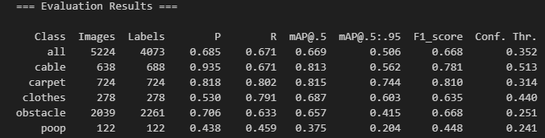
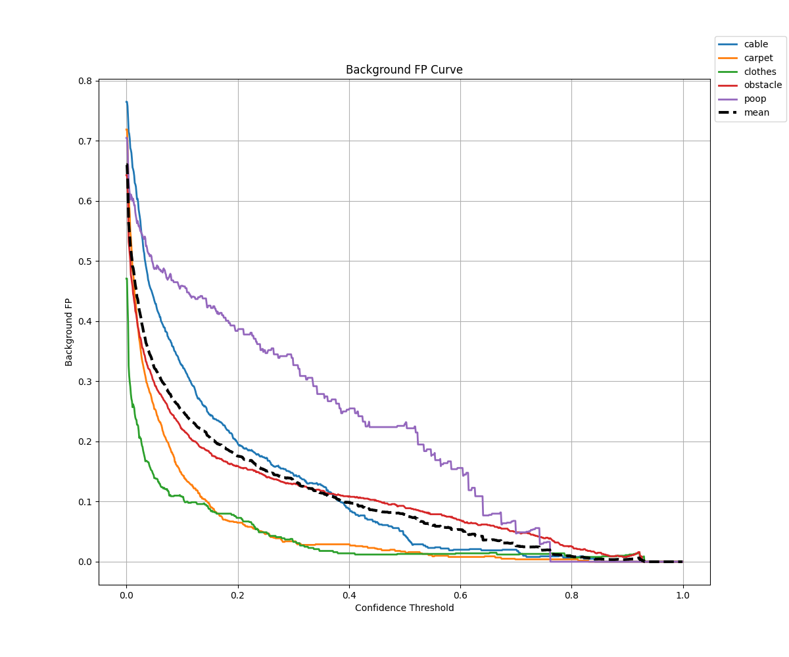
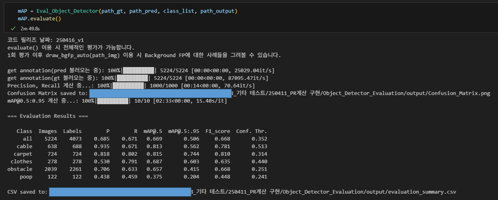
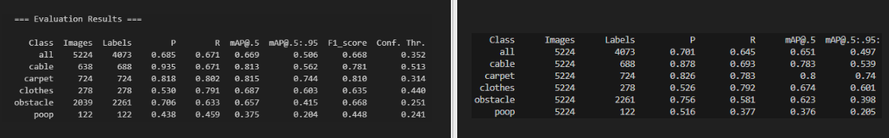
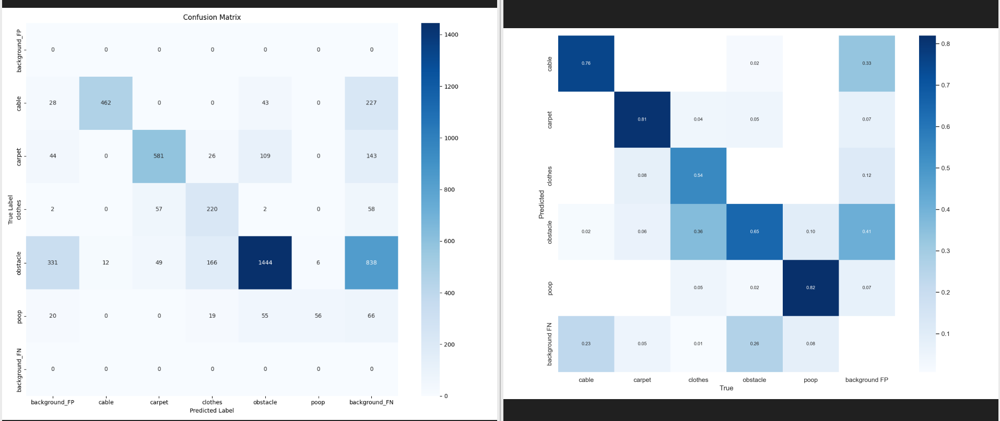
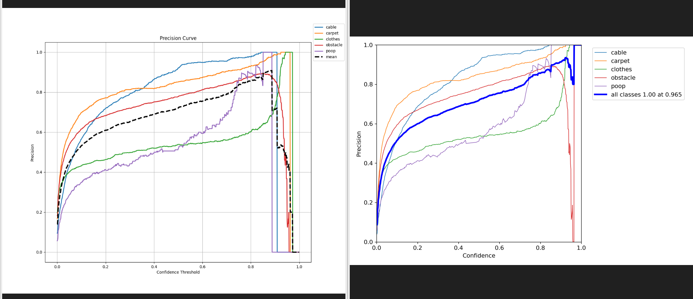
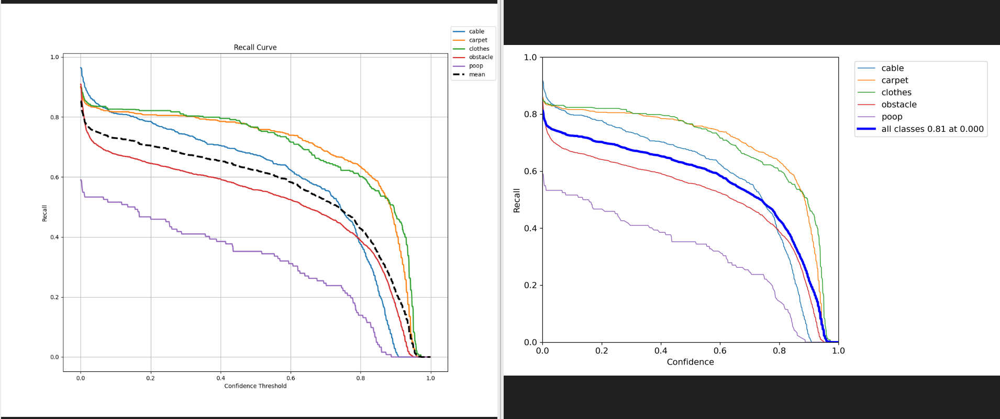
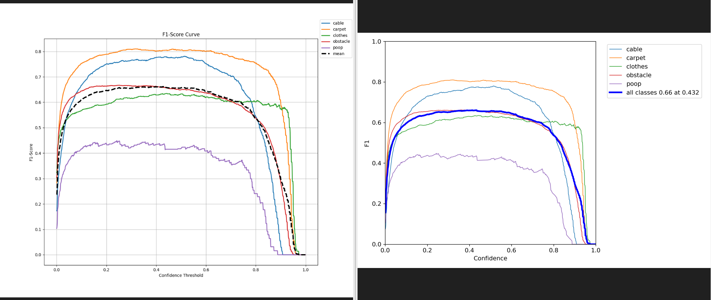
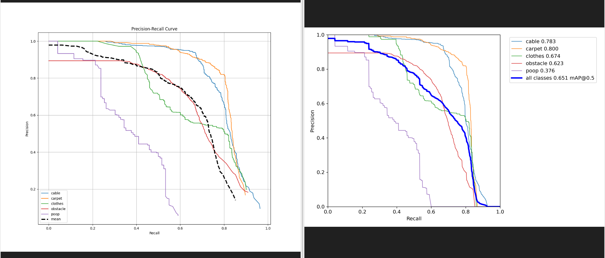

# YOLO 기반 사물 인식 성능 평가 모듈

## 개요

이 모듈은 YOLO 계열의 사물 인식 모델 성능을 정밀하게 평가할 수 있도록 설계된 평가 도구입니다. 기존 `YOLOv7`의 `test.py`에서 제공하는 mAP 외에도, **정확도(Precision)**, **재현율(Recall)**, **F1-Score**, **배경에 대한 오탐지(Background False Positive)**까지 다양한 지표를 **Confidence Threshold**별로 수치화하여 저장하고 시각화합니다.

---

## 주요 기능

- **mAP@0.5, mAP@0.5:0.95** 자동 계산에서 best f1-score가 도출되는 conf. thresh.를 함께 제공
  
- 클래스별 **Precision, Recall, F1-Score** 및 **Background FP** 곡선 시각화
- **Confusion Matrix** 시각화 및 저장
- **best F1-score 기준 Conf. Thresh** 자동 탐색
- Background False Positive 시각화 기능 (draw_bgfp_auto)
  
---

## 사용 방법

```python
from module_name import Eval_Object_Detector

evaluator = Eval_Object_Detector(
    path_gt='경로/ground_truth',
    path_pred='경로/prediction',
    class_list=['class1', 'class2'],
    path_output='경로/output'
)

evaluator.evaluate()
evaluator.draw_bgfp_auto(path_img='경로/images')
```

## 실행 결과 예시  
  

---

## 평가 기준 예시

- 기존 YOLO `test.py`의 출력과 비교한 정량 지표 차이(좌측: Ours | 우측:YOLOv7 Repo.)  

mAP 결과표  
  

coufusion matrix  
  

p 커브  
  

r 커브  
  

f1 커브  
  

pr 커브  
  
---

## 장점 및 특징

1. **Background False Positive 시점 확인**  
   conf. thresh. 별로 background FP 발생 시점을 알 수 있어, **모델의 정밀도가 중요한 상황에서 매우 유용**합니다.

2. **정확한 수치 기반 분석**  
   Precision에 대응되는 Recall을 **정확한 수치 기반으로 저장**하므로, 대략적인 시각적 해석이 아닌 **수치 기반의 객관적 평가**가 가능합니다.

3. **기존 YOLO 평가와 높은 일치율**  
   YOLO의 기존 코드와 mAP@0.5:0.95 기준으로 **0.9% 이내의 오차만 존재**, 사실상 동등한 정확도 수준을 보장합니다.

4. **클래스별 Confusion Matrix 자동 출력**  
   각 클래스의 오탐지 및 미탐지 현황을 시각화하여 **모델의 한계 분석**에 도움을 줍니다.

5. **Background FP 이미지 시각화 자동화**  
   오탐된 bbox가 어떤 이미지에서 발생했는지를 직접 확인할 수 있는 **draw_bgfp_auto() 기능 제공**

---

## 결과물

- `evaluation_summary.csv`: 최종 평가 결과 요약
- `results.json`: conf. thresh. 별 PR 결과 저장
- `Confusion_Matrix.png`: F1-score 기준 confusion matrix
- 다양한 지표의 곡선 그래프 이미지 (Precision, Recall, F1-Score, Background FP 등)

---

## 환경 및 의존성

- Python >= 3.10
- 필수 패키지:
  - numpy
  - pandas
  - matplotlib
  - seaborn
  - tqdm
  - natsort
  - scikit-learn

---

## 기타

- YOLOv7의 `--save-txt`와 `--save-conf` 옵션을 통해 예측 결과를 저장한 경우를 기준으로 동작합니다.
- 기존 레이블 형식은 YOLO format을 따릅니다.

---

© 2025. 개발자 라이언.
